# **将一部分扫雷问题编码到SAT并进行求解**

## 1 前提

  	扫雷是一个经典的NP完全问题参考[Minesweeper and NP-completeness (bham.ac.uk)](https://web.mat.bham.ac.uk/R.W.Kaye/minesw/ordmsw.htm)，下面求解的尝试只是对棋盘上的小型的区域进行求解，将每一个3X3的可解区域编码到SAT上并通过Z3求解器求解。下文并不是将扫雷问题在多项式时间内解出，因为其是一个NPC问题，并且下面的算法是会在一定概率下出错的算法。本文仅仅是尝试将棋盘上的小区域编码到SAT上。

​	扫雷：在给定大小N*N上的雷盘上具有M个程序预先初始化的雷，之后对于求解器K其每次遍历雷盘上的可解点（1）进行编码求解，得到未知位置中含雷的概率。通过argmax函数选取为雷概率最小的位置作为下一步点击位置

（1）  可解点：对于一个3x3大小的视窗，如果其中心位置被翻开且周围八个点位置中具有未知属性的方格，则证明其可以编码到SAT上并通过Z3求解器求解

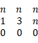

可以被编码的样本

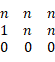

不可被编码的样本

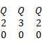

不可被编码的样本

 

## 2 算法

​	对于任意的雷盘状态Q，求解器遍历雷盘上的可解点，对可解点周围位置点进行求解，如果具有多个可行解则对其概率进行叠加计算。当状态Q求解完成，依次寻找确定安全的位置并执行点击炒作，当雷盘上可解点中不具备确定性的点，则通过argmax选择概率最小的点作为下一个状态的执行条件。在这一步中会出现错误的选择。

## 3 算法伪码

  =================================

```lua
\# 随机状态
Q=RandomEnv()
Action=RandomAction()
GameOver=false
  While not GameOver do
  begin
​    For i:=0 To Q行数 
​      For j:=0 To Q列数
​       begin
​       IF Q[i,j]为可解点:
​         求解
​       end;
​    if anySafe:
​    begin
\# 查找任意安全点
​     Action=FoundSafe(Q)
​     \# Q执行Action
​     Q(Action)
   end;
​    \# 安全点不存在
​    Action=argmax(Q)
​    Q(Action)
  end;
```

  =================================

## 4 编码规则

  	对应的任意的可解点Q，以及其周围3x3的区域范围，通过编码赋予3x3的网格相应的文字，然后将他们拼接成为一条语句，放入Z3求解器进行求解

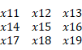

编码样例Q

之后将该区域内已经翻开且不为雷的区域值设置为0

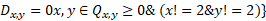

之后将中心点x,y的值设置为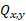

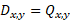

将未知点设置为变量得到语句

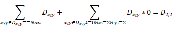

将语句带入Z3求解器中进行求解得到所有解并对这些解进行确定性判断，确定性的解指的是可以确定为雷的区域


具有确定性解的样本

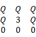

具有多种解的样本

对于任意状态Q，将其确定性解加入下一步执行队列当中。重复以上操作直到状态Q中不存在非确定性解。当确定性状态的解全部执行完成后，通过argmax函数获取得到该状态下最优的解位置，并依次执行。

在这一步当中存在一定概率使得最优方法失效，即存在不可解的情况

## 5 计算复杂度

  对于任意状态下的扫雷问题假定其棋盘大小为M*N其中地雷数量为K，那么任意状态下所需要遍历的最大次数为

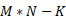

而最大的状态次数为


对于3X3区域求解的一般时间复杂度为


综上得知计算复杂度的值小于

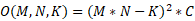

 

## 6 错误分析

在16X16大小的棋盘上布置40颗雷进行100次实验，其中大多数情况是可解的。但当加大棋盘大小以及地雷数量，求解算法在游戏末期容易出现错误选择的情况，具体原因在于argmax算法失效，在相应的状态Q下低概率的区域出现了是雷的情况、或者在剩余的格子当中出现最低概率全部相同的情况。这从侧面可以证明对于扫雷问题没有一个确定性的解。

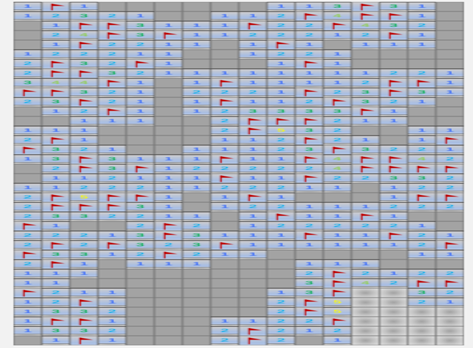

无解情况1

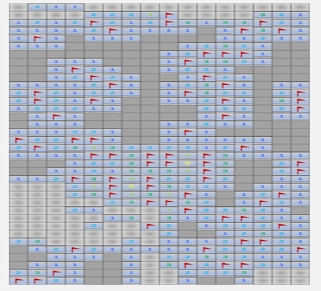

无解情况二

对于扫雷任务在上诉无解状态Q1、Q2下无法通过SAT对其进行无错的求解，没有一个确定性的答案，

## 7 项目结构介绍

Solver_mine.py是扫雷游戏的实现包括棋盘大小雷数等基本设置类

slover_mine.py是对应棋盘内部3X3 边缘2X3 角点2X2的Z3求解类

gaming.py 是对应的主类直接运行即可

save_log.py 是保存恢复中间状态的功能函数

draw_process.py 是对扫雷的可视化

resource目录下是原始图片文件

no solution目录下是未解决的

answer 是日志记录目录

## 8 运行中间状态

10,8

\* * * * -1 1 0 0 0 0 1 * * * * *

\* * * * 1 1 0 0 0 1 * * * * * *

\* * * 1 0 0 1 1 1 1 -1 * * * * *

\* * * 2 0 0 1 -1 1 1 2 * * * * *

\* * * 2 0 0 1 1 1 0 0 1 1 * * *

\* * * 2 0 0 0 0 0 0 0 0 0 1 * *

\* * * 1 0 0 0 0 0 0 0 1 1 * * *

\* * * 1 0 0 0 1 1 1 0 1 -1 * * *

\* * * * 2 1 0 2 -1 3 1 * * * * *

\* * * * -1 1 0 2 -1 * * * * * * *

\* * * * * 2 0 1 1 * * * * * * *

\* * * * * * 1 * * * * * * * * *

\* * * * * * * * * * * * * * * *

\* * * * * * * * * * * * * * * *

\* * * * * * * * * * * * * * * *

\* * * * * * * * * * * * * * * *

其中

最上方10，8代表Q状态下求解出的点击的位置

-1代表标记的雷

*代表未知状态

其他数字代表周围的雷的数量
